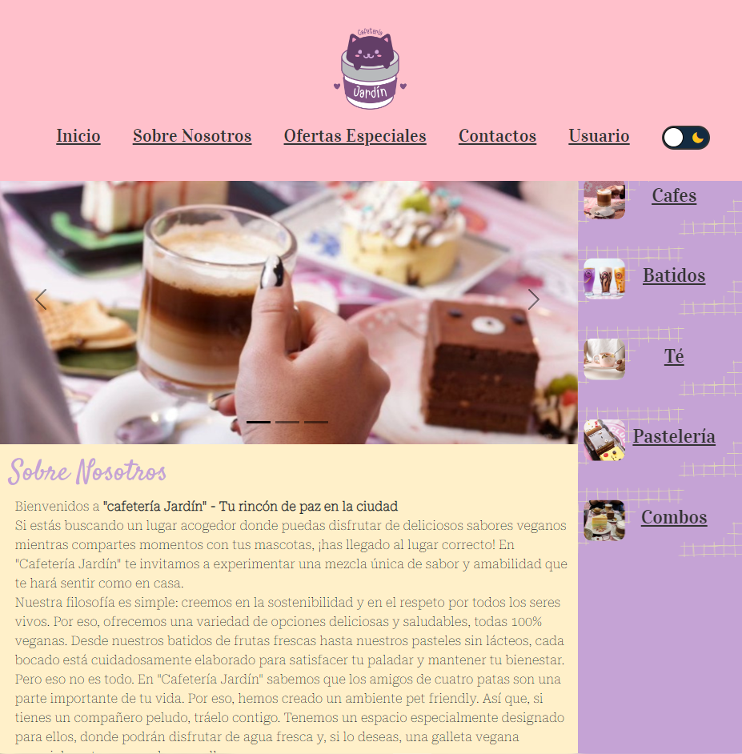

# Pagina Web - Cafeteria

Esta es una pagina web de una cafeteria "Jardín" realizada por la estudiante Paula M. Villagra para el curso de Programación Web del programa BA Multiplica 2023.

Es una pagina sencilla que cuenta con diferentes secciones para: Inicio, Sobre nosotros, Ofertas, Productos, Contactos y Redes Sociales.

## Link

Insert gif or link to demo

https://paulaavilla.github.io/TP_ProgramacionWeb/
## Capturas

## PaletaColores

Modo Claro
| Color             | Hex                                                                |
| ----------------- | ------------------------------------------------------------------ |
| Amarillo |  #fff0c9 |
| Lila |  #c5a3d5 |
| Rosa |  #ffc0cb |
| Gris |  #808080 |

Modo Oscuro
| Color             | Hex                                                                |
| ----------------- | ------------------------------------------------------------------ |
| Gris Oscuro |  #333 |
| Morado |  #816981 |
| Purpura |  #725f7b |
| Rosa |  #ffc0cb |
| Gris |  #808080 |

## Authors

- [@paulaavilla](https://github.com/paulaavilla)
Paula M. Villagra

